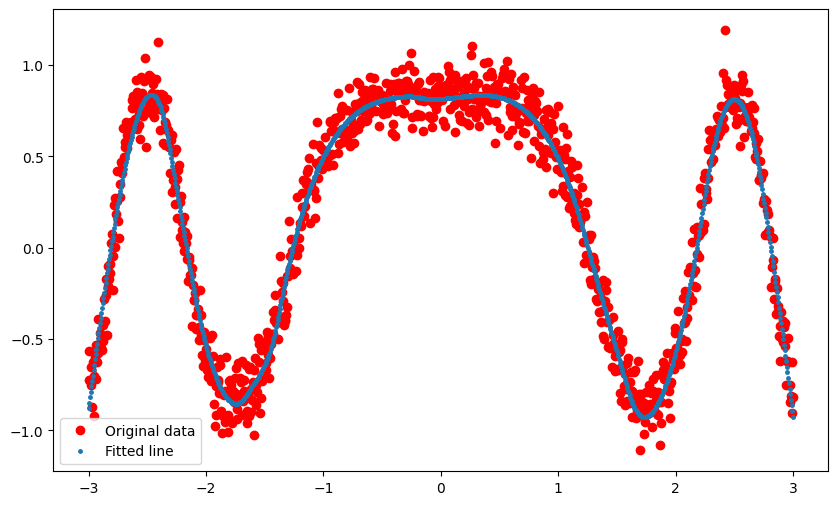
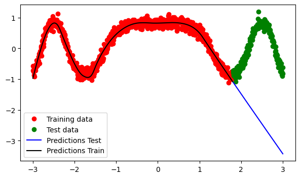
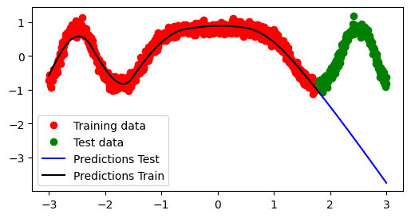
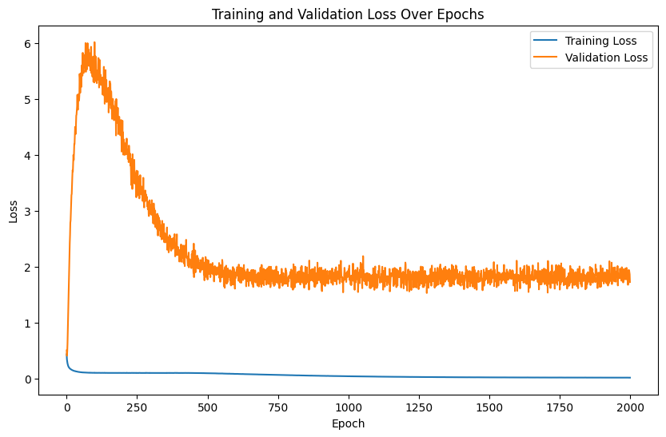
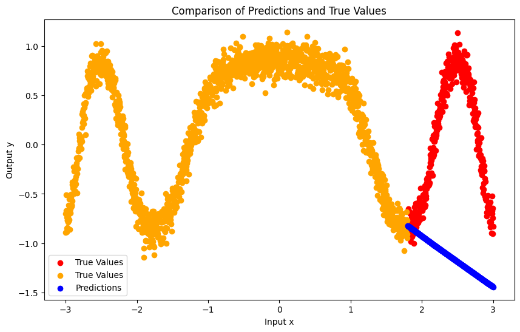

## Introduction to Neural Networks with PyTorch

Neural networks are nonlinear models that consist of a composition of linear and nonlinear functions. They are used to model complex relationships between inputs and outputs or to find patterns in data. In this notebook, we will introduce the basic concepts of neural networks and how to implement them using PyTorch.

A linear model with multiple inputs $$\mathbf x = (x_1, x_2, \ldots, x_n)$$ and multiple outputs $$\mathbf y = (y_1, y_2, \ldots, y_m)$$ can be written as:

$$
\mathbf y = \mathbf W \mathbf x + \mathbf b,
$$

or $$y_i = \sum_{j=1}^n W_{ij} x_j + b_i$$, where $$W_{ij}$$ are the weights and $$b_i$$ are the biases of the model. The weights and biases are learned from data using an optimization algorithm such as gradient descent.

If the model is nonlinear (e.g. logistic regression), the model can be written as:

$$
\mathbf y = f(\mathbf W \mathbf x + \mathbf b),
$$

where $$f$$ is a nonlinear function called the activation function. In the case of logistic regression in the context of multi-class classification, $$f$$ is the Softmax function. The activation function is applied element-wise to the output of the linear model.

Given an input vector $$\mathbf{x}$$, a neural network computes the output $$\mathbf{y}$$ as follows:

$$
\mathbf{y} = f(\mathbf{W}_L f(\mathbf{W}_{L-1} f(\ldots f(\mathbf{W}_1 \mathbf{x} + \mathbf{b}_1) \ldots) + \mathbf{b}_{L-1}) + \mathbf{b}_L)
$$

where $$\mathbf{W}_i$$ and $$\mathbf{b}_i$$ are the weights and biases of the $$i$$-th layer, and $$f$$ is a nonlinear function called the activation function. The number of layers and the number of neurons in each layer are hyperparameters of the model.

One can rewrite the above equation as a composition of linear and nonlinear functions as follows (assuming the biases are absorbed into the weights):

$$
\mathbf{y} = f_L \circ \mathbf W_L \circ f_{L-1} \circ \mathbf W_{L-1} \circ \ldots \circ f_1 \circ \mathbf W_1 (\mathbf{x})
$$

In other words, deep networks (i.e. networks with many layers) are a composition of linear and nonlinear functions.


## PyTorch

PyTorch is a popular open-source machine learning library for Python. It is widely used for deep learning and is known for its flexibility and ease of use. PyTorch provides a set of tools for building and training neural networks. In this notebook, we will use PyTorch to implement a simple neural network for binary classification.

For a complete introduction to PyTorch, it's always best to refer back to the original [PyTorch Tutorials](https://pytorch.org/tutorials/).

PyTorch is essentially a library for computation using tensors, which are similar to NumPy arrays. However, PyTorch tensors can be used on a GPU to accelerate computing. PyTorch also provides a set of tools for automatic differentiation, which is essential for training neural networks.


```python
import torch
import torch.nn as nn
import torch.optim as optim
import numpy as np
import matplotlib.pyplot as plt
import torch.nn.functional as F

```

Let's first generate some synthetic data to illustrate the concepts. The input data is a one-dimensional vector between -3 and 3, and the output data is also one-dimensional with known map: $$\sin(\cos(x^2))$$.


```python
# Generate synthetic data
x = torch.unsqueeze(torch.linspace(-3, 3, 1000), dim=1)  # x data (tensor), shape=(100, 1)
y = torch.sin(torch.cos(x.pow(2))) + 0.1 * torch.randn(x.size())  # noisy y data (tensor), shape=(100, 1)
```

One generated, we will create our first neural network as follows:


```python

# Define a simple neural network
class Net(nn.Module):
    def __init__(self):
        super(Net, self).__init__()
        self.fc1 = nn.Linear(1, 20)  # Input layer to hidden layer
        self.fc2 = nn.Linear(20, 1)  # Hidden layer to output layer

    def forward(self, x):
        x = F.elu(self.fc1(x))
        x = self.fc2(x)
        return x

net = Net()

```

The next step is to define a the loss function we want to minimize, the optimizer (e.g. stochastic gradient descent), and the training loop. 


```python

# Define loss function and optimizer
criterion = nn.MSELoss()
optimizer = optim.Adam(net.parameters(), lr=0.01)
# optimizer = optim.SGD(net.parameters(), lr=0.01)

# Train the network
epochs = 10000
loss_list = []
for epoch in range(epochs):
    
    output = net(x)  # input x and predict based on x
    
    loss = criterion(output, y)  # calculate loss
    
    loss.backward()  # backpropagation, compute gradients
    
    optimizer.step()  # apply gradients

    optimizer.zero_grad()  # clear gradients for next train

    if epoch % 100 == 0:
        l = loss.item()
        print(f'Epoch [{epoch}/{epochs}], Loss: {l}')
        loss_list.append(l)

```

    Epoch [0/10000], Loss: 0.6821308732032776
    Epoch [100/10000], Loss: 0.30670949816703796
    Epoch [200/10000], Loss: 0.2545710802078247
    Epoch [300/10000], Loss: 0.21012984216213226
    ...
    Epoch [9700/10000], Loss: 0.011732068844139576
    Epoch [9800/10000], Loss: 0.011715428903698921
    Epoch [9900/10000], Loss: 0.011688318103551865


```python

# Plot the results
predicted = net(x).data.numpy()

plt.figure(figsize=(10, 6))
plt.plot(x.numpy(), y.numpy(), 'ro', label='Original data')
plt.plot(x.numpy(), predicted, '.', ms=5, label='Fitted line')
plt.legend()
plt.show()

```


    

    


### Split data in terms of test and training sets
To make things in a little more general, we will split the data into test and training sets (a functionality pytorch provides). And we will define a training loop.


```python
# Split the data into training and test sets
train_size = int(0.8 * len(x))
test_size = len(x) - train_size
x_train, x_test = torch.split(x, [train_size, test_size])
y_train, y_test = torch.split(y, [train_size, test_size])

# Define a simple neural network
net = Net()

# Define loss function and optimizer
criterion = nn.MSELoss()
optimizer = optim.Adam(net.parameters(), lr=0.01)

# Test function
def evaluate(net, x):
    net.eval()  # Set the network to evaluation mode
    with torch.no_grad():  # Gradient computation is not needed for inference
        predictions = net(x)
    return predictions

# Training function
def train(net, criterion, optimizer, x_train, y_train, epochs):
    eval_loss_list = []
    train_loss_list = []
    for epoch in range(epochs):
        output = net(x_train)
        loss = criterion(output, y_train)
        loss.backward()
        optimizer.step()
        optimizer.zero_grad()

        # Logging
        eval_loss = criterion(evaluate(net, x_test), y_test)
        eval_loss_list.append(eval_loss.item())
        train_loss_list.append(loss.item())

        # Print
        if epoch % 100 == 0:
            print(f'Epoch [{epoch}/{epochs}], Loss: {loss.item()}, Eval Loss: {eval_loss.item()}')

    
    return eval_loss_list, train_loss_list


# Train the network
eval_loss_list, train_loss_list = train(net, criterion, optimizer, x_train, y_train, epochs=epochs)

# Test the network
predictions = evaluate(net, x_test)
predictions_train = evaluate(net, x_train)


```

    Epoch [0/10000], Loss: 1.0209460258483887, Eval Loss: 0.47471943497657776
    Epoch [100/10000], Loss: 0.2437507063150406, Eval Loss: 1.9558813571929932
    Epoch [200/10000], Loss: 0.1876702457666397, Eval Loss: 3.7715249061584473
    Epoch [300/10000], Loss: 0.1533692330121994, Eval Loss: 4.865594863891602
    ...
    Epoch [9600/10000], Loss: 0.013891083188354969, Eval Loss: 6.588351249694824
    Epoch [9700/10000], Loss: 0.013884264975786209, Eval Loss: 6.602405548095703
    Epoch [9800/10000], Loss: 0.013858012855052948, Eval Loss: 6.517797470092773
    Epoch [9900/10000], Loss: 0.013836232014000416, Eval Loss: 6.527523040771484


```python
# Plot training data, test data, and the model prediction
plt.figure(figsize=(7, 4))
plt.plot(x_train.data.numpy(), y_train.data.numpy(), 'ro', label='Training data')
plt.plot(x_test.data.numpy(), y_test.data.numpy(), 'go', label='Test data')
plt.plot(x_test.data.numpy(), predictions.data.numpy(), 'b-', label='Predictions Test')
plt.plot(x_train.data.numpy(), predictions_train.data.numpy(), 'k-', label='Predictions Train')
plt.legend()
plt.show()
```


    

    


```python
# Plotting the training and validation losses
# %matplotlib widget
plt.figure(figsize=(6, 3))
plt.plot(eval_loss_list, label='Validation Loss')
plt.plot(train_loss_list, label='Training Loss')
plt.xlabel('Epoch')
plt.ylabel('Loss')
plt.title('Training and Validation Loss Over Epochs')
plt.legend()
plt.show()
```


    

    


One way to prevent overfitting is to add a regularization term. In Pytorch, that's as simple as adding a weight_decay argument to the optimizer.


```python
net_reg = Net()

optimizer = optim.Adam(net_reg.parameters(), lr=0.01, weight_decay=1e-3)
criterion = nn.MSELoss()

# Train the network
eval_loss_list_reg, train_loss_list_reg = train(net_reg, criterion, optimizer, x_train, y_train, epochs=epochs)

# %matplotlib widget
plt.figure(figsize=(6, 3))
plt.plot(eval_loss_list, label='Validation Loss')
plt.plot(eval_loss_list_reg, label='Validation Loss + Reg')
plt.plot(train_loss_list, label='Training Loss')
plt.xlabel('Epoch')
plt.ylabel('Loss')
plt.title('Training and Validation Loss Over Epochs')
plt.legend()
plt.show()

```

    Epoch [0/10000], Loss: 0.6676998734474182, Eval Loss: 0.38871660828590393
    Epoch [100/10000], Loss: 0.2478753626346588, Eval Loss: 1.7191311120986938
    Epoch [200/10000], Loss: 0.16863811016082764, Eval Loss: 3.6293625831604004
    Epoch [300/10000], Loss: 0.13257873058319092, Eval Loss: 4.246905326843262
    ...
    Epoch [9600/10000], Loss: 0.023531725630164146, Eval Loss: 7.310266494750977
    Epoch [9700/10000], Loss: 0.023503370583057404, Eval Loss: 7.3122663497924805
    Epoch [9800/10000], Loss: 0.023470932617783546, Eval Loss: 7.298105239868164
    Epoch [9900/10000], Loss: 0.023576727136969566, Eval Loss: 7.240044116973877


    

    


```python
predictions_test_reg = evaluate(net_reg, x_test)
predictions_train_reg = evaluate(net_reg, x_train)

# Plot training data, test data, and the model prediction
plt.figure(figsize=(6, 3))
plt.plot(x_train.data.numpy(), y_train.data.numpy(), 'ro', label='Training data')
plt.plot(x_test.data.numpy(), y_test.data.numpy(), 'go', label='Test data')
plt.plot(x_test.data.numpy(), predictions_test_reg.data.numpy(), 'b-', label='Predictions Test')
plt.plot(x_train.data.numpy(), predictions_train_reg.data.numpy(), 'k-', label='Predictions Train')
plt.legend()

```


    <matplotlib.legend.Legend at 0x7fcc005dbeb0>


    

    


## Dataloaders, training and validation loops

Finally, let's add a validation loop to our training loop. We will use the validation set to evaluate the model's performance and to prevent overfitting. We will also use PyTorch's DataLoader to load the data in batches and to shuffle the data to facilitate batch gradient descent.


```python
from torch.utils.data import TensorDataset, DataLoader

# Generate synthetic data
x = torch.unsqueeze(torch.linspace(-3, 3, 2000), dim=1)
y = torch.sin(torch.cos(x.pow(2))) + 0.1 * torch.randn(x.size())

# Split the data into training and test sets and create DataLoaders
train_size = int(0.8 * len(x))
test_size = len(x) - train_size
x_train, x_test = torch.split(x, [train_size, test_size])
y_train, y_test = torch.split(y, [train_size, test_size])

train_dataset = TensorDataset(x_train, y_train)
train_loader = DataLoader(dataset=train_dataset, batch_size=64, shuffle=True)

test_dataset = TensorDataset(x_test, y_test)
test_loader = DataLoader(dataset=test_dataset, batch_size=64, shuffle=False)

# Define the neural network
class Net(nn.Module):
    def __init__(self):
        super(Net, self).__init__()
        self.fc1 = nn.Linear(1, 50)
        self.fc2 = nn.Linear(50, 1)

    def forward(self, x):
        x = torch.relu(self.fc1(x))
        x = self.fc2(x)
        return x

net = Net()

# Define loss function and optimizer
criterion = nn.MSELoss()
optimizer = optim.Adam(net.parameters(), lr=1e-3)

# Train step function
def train_step(model, criterion, optimizer, x, y):
    model.train()
    optimizer.zero_grad()
    output = model(x)
    loss = criterion(output, y)
    loss.backward()
    optimizer.step()
    return loss.item()

# Validation step function
def validation_step(model, criterion, x, y):
    model.eval()
    with torch.no_grad():
        output = model(x)
        loss = criterion(output, y)
    return loss.item()

# Training and evaluation loop with loss tracking
def train_and_evaluate(model, criterion, optimizer, train_loader, test_loader, epochs):
    train_losses = []
    val_losses = []
    for epoch in range(epochs):
        train_loss = 0.0
        for x_batch, y_batch in train_loader:
            train_loss += train_step(model, criterion, optimizer, x_batch, y_batch)
        train_loss /= len(train_loader)
        train_losses.append(train_loss)

        val_loss = 0.0
        for x_batch, y_batch in test_loader:
            val_loss += validation_step(model, criterion, x_batch, y_batch)
        val_loss /= len(test_loader)
        val_losses.append(val_loss)

        if epoch % 100 == 0:
            print(f'Epoch [{epoch}/{epochs}] Train Loss: {train_loss:.4f}, Validation Loss: {val_loss:.4f}')

    return train_losses, val_losses

# Run the training and evaluation
train_losses, val_losses = train_and_evaluate(net, criterion, optimizer, train_loader, test_loader, epochs=2000)


```

    Epoch [0/2000] Train Loss: 0.4311, Validation Loss: 0.5021
    Epoch [100/2000] Train Loss: 0.0997, Validation Loss: 5.3832
    Epoch [200/2000] Train Loss: 0.0972, Validation Loss: 4.4078
    Epoch [300/2000] Train Loss: 0.0971, Validation Loss: 3.1139
    Epoch [400/2000] Train Loss: 0.0965, Validation Loss: 2.0922
    Epoch [500/2000] Train Loss: 0.0922, Validation Loss: 1.7717
    Epoch [600/2000] Train Loss: 0.0816, Validation Loss: 1.7966
    Epoch [700/2000] Train Loss: 0.0680, Validation Loss: 1.6681
    Epoch [800/2000] Train Loss: 0.0568, Validation Loss: 1.7936
    Epoch [900/2000] Train Loss: 0.0466, Validation Loss: 1.9601
    Epoch [1000/2000] Train Loss: 0.0385, Validation Loss: 1.8654
    Epoch [1100/2000] Train Loss: 0.0317, Validation Loss: 1.7997
    Epoch [1200/2000] Train Loss: 0.0268, Validation Loss: 1.8322
    Epoch [1300/2000] Train Loss: 0.0229, Validation Loss: 1.8768
    Epoch [1400/2000] Train Loss: 0.0203, Validation Loss: 1.8477
    Epoch [1500/2000] Train Loss: 0.0179, Validation Loss: 1.7285
    Epoch [1600/2000] Train Loss: 0.0163, Validation Loss: 1.7835
    Epoch [1700/2000] Train Loss: 0.0154, Validation Loss: 1.9504
    Epoch [1800/2000] Train Loss: 0.0145, Validation Loss: 1.7333
    Epoch [1900/2000] Train Loss: 0.0140, Validation Loss: 1.7543


```python
# Plotting the training and validation losses
plt.figure(figsize=(10, 6))
plt.plot(train_losses, label='Training Loss')
plt.plot(val_losses, label='Validation Loss')
plt.xlabel('Epoch')
plt.ylabel('Loss')
plt.title('Training and Validation Loss Over Epochs')
plt.legend()
plt.show()

```


    

    


```python
# After training
net.eval()
x_test_tensor = torch.tensor(x_test, dtype=torch.float32)
predictions = net(x_test_tensor).detach().numpy()

# Plot the results
plt.figure(figsize=(10, 6))
plt.scatter(x_test, y_test, color='red', label='True Values')
plt.scatter(x_train, y_train, color='orange', label='True Values')
plt.scatter(x_test, predictions, color='blue', label='Predictions')
plt.title('Comparison of Predictions and True Values')
plt.xlabel('Input x')
plt.ylabel('Output y')
plt.legend()
plt.show()
```

    /var/folders/wq/rd7c2mhn7fs9y313qjs3c58r0000gn/T/ipykernel_56098/523898071.py:3: UserWarning: To copy construct from a tensor, it is recommended to use sourceTensor.clone().detach() or sourceTensor.clone().detach().requires_grad_(True), rather than torch.tensor(sourceTensor).
      x_test_tensor = torch.tensor(x_test, dtype=torch.float32)


    

    

